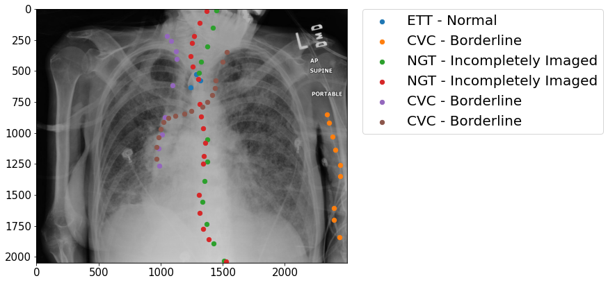
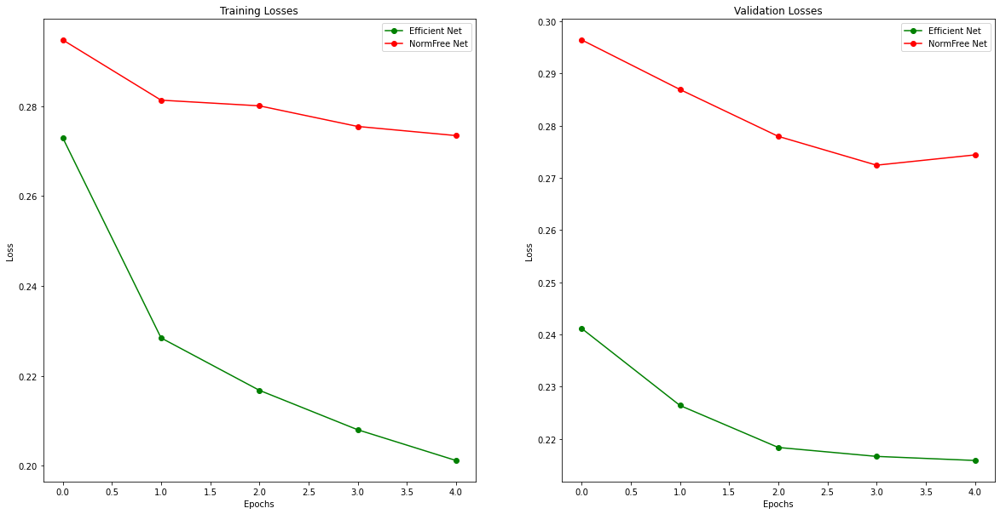

# Catheter Tube Detection using Normalization Free Networks in PyTorch



<p align="center">


</p>

My work on classifying the presence and correct placement of catheter tubes on chest x-rays to save lives.

## Introduction

This repository houses code that I used for the RANZCR CLiP Catheter Tube detection competition on Kaggle.

The aim here was the predict if a Catheter tube was placed correctly in a patient's body via chest-xrays. This problem is important as it will potentially save a lot of lives if detection if done early and with substantial precision.

In this task, we had 11 classes to classify and in some cases a same class was 

## Code Walkthrough

Below is a small code-walkthrough where I explain, what does what.

```
- train.py
- requirements.txt
- src/
    | -augments.py
    |
    | -dataloader.py
    |
    | -models.py
    |
    | -trainer.py
```

Above is the file structure in this project repository.

A brief explanation to what each file does is down below:

* `train.py`: This file is the entry file that you will be running. It binds together all the code in all the files and runs the training and validation loops. In most cases, you will have to just change the dataloader a bit (more on that later) and then run this script with changed locations and names, of course.

* `augments.py`: This file contains the Augmentations (by using albumentations framework) for training and validation data. This is very data specific and I would recommend you to change it your needs.

* `dataloader.py`: This file contains the Dataloader logic. For any task, you will have to do at-least some modifications with the class inside of the file like changing the data paths, and image reading sequence, etc.

* `models.py`: This file currently only contains Normalization Free Networks and Efficient Networks. These different architecture's class does one and only one thing: It loads a model using the timm library and replaces it's last Linear layers with a new layers that has num_neurons = num_classes. This can be left as is and no modification is required.

* `trainer.py`: This file has the main Trainer class. I have taken the standard pytorch training and validation routines and put them inside a class with nice tqdm progress bars and some memory optimizations. Now if you, for example want to train your model, you will just have to initialize a Trainer instance and then do something like:

```python
# For training
trainer.train_one_cycle()

# For validation
trainer.valid_one_cycle()
```

The code in this repository is pretty self-explanatory only if you have some experience with pytorch using image data and fine-tuning pre-trained image models.

## Training the Model

If you want to train the model on this data as-is, then you would typically have to perform 2 steps:

### 1. Getting the Data right

First, download the data from [here](https://www.kaggle.com/c/ranzcr-clip-catheter-line-classification/data).

Now, take the downloaded .zip file and extract it into a new folder: `input/`

Make sure the `input/` folder is at the same directory level as the `train.py` file.

### 2. Training the Model

If you have done the above steps right, then just running the `train.py` script should not produce any errors.

To run training, open the terminal and change your working directory to the same level as the `train.py` file.

*[Optional]: If you don't have the requirements installed, do:*

```shell
$ pip install -r requirements.txt
```

Now, for training do:

```shell
$ python train.py
```

This should start a training in a few seconds and you should see a progress bar.

If you are having any problems related to anything, please open an Issue and I will be happy to help!

## Training Results and Conclusion

Below is the comparison of Training and Validation losses when training Efficient Networks and NormFree Networks on the same subset of data with same other parameters.

